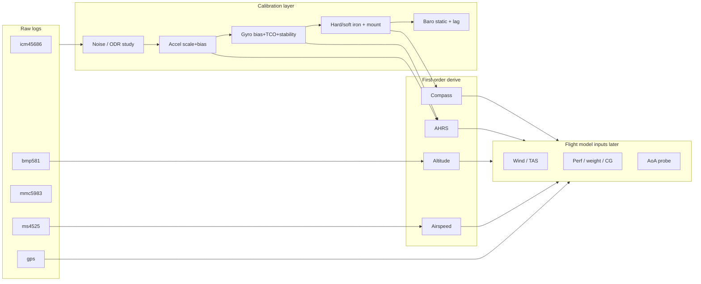

# Flight analysis & modeling plan

Roadmap from raw flight DBs → calibrated sensors → first-order derive →
flight-model inputs. Offline work lives under `analysis/`; flight DBs always
keep **raw** samples. Corrections are a layer (scripts first, optional online
later).

Related: [`README.md`](README.md) (tooling), [`../icm45686-bias-compensation.md`](../icm45686-bias-compensation.md)
(IMU online apply design), [`../timestamps.md`](../timestamps.md).



---

## Phase 0 — Motion windows ✓

**Status:** implemented (`analysis/windows.py`, CLI `windows`).

Label every session in `~/kingfisher/flights/` (aircraft **and** desk soaks)
into 1 s epochs, then merge contiguous runs:

| Label | Meaning |
|-------|---------|
| `stationary` | Still — calibration pool (“level windows”) |
| `taxi` | GPS gs in taxi band (default 5–40 kt) |
| `flight` | GPS gs ≥ 40 kt |
| `transient` | Bump / pick-up, or motion without GPS taxi/flight |

Without reliable GPS → only `stationary` / `transient`. Pre-session pod
backlog (`ts_ns < _session.start_time`) excluded.

**Parquet** (partitioned by session for append-friendly re-runs):

```
~/kingfisher/analysis-cache/windows/
  manifest.json
  epochs/session_id=<stem>/part.parquet
  segments/session_id=<stem>/part.parquet
  segments_all.parquet
```

```bash
uv run --project analysis python scripts/analyze_flights.py windows
```

---

## Phase 1 — Sensor noise & parameter study

**Status:** 1a done; 1b cruise profiles confirmed for ICM-45686, BMP581, and
MMC5983 (desk soaks in [`sensor_noise.md`](sensor_noise.md)). ICM: chip 200 Hz /
LPF 12.5 / boxcar→25 Hz. BMP: 25 Hz, OSR×32, IIR 3. MMC: BW 100 / ODR 20 Hz
(at datasheet floor). MS4525 / confirmation flight still open.
Tooling: `analysis/noise.py`, CLI `noise`.

**Goal:** quantify noise vs rate/scale/filter; recommend bench + aircraft
settings.

### 1a. Noise floor (stationary windows)

On `stationary` segments (soaks + hangar), for `icm45686_accel`,
`icm45686_gyro`, `bmp581`, `mmc5983`:

- Per-axis / magnitude σ, σ of 1 s means
- Allan deviation (or autocorrelation) where segment length allows
- Noise vs configured `sampling_frequency` from `sensor_attrs` when it differs
  across sessions
- Note stored rate vs chip ODR (e.g. IMU often stored ~10 Hz while chip ODR
  is hundreds of Hz)

**Deliverable:** `docs/analysis/sensor_noise.md` + plots under
`~/kingfisher/analysis-cache/noise/`; CLI `noise`.

### 1b. Parameter experiments

| Sensor | Knobs | Metrics |
|--------|-------|---------|
| ICM45686 | ODR, full-scale, HW filter if exposed | noise density, flight saturation |
| BMP581 | ODR / OSR / IIR | σ(P), lag vs GPS alt in climb |
| MMC5983 | ODR / bandwidth | σ(‖B‖), heading jitter after cal |

**Offline (now):** compare noise across sessions that already used different
attrs; recommend config profiles (`taxi_cal`, `cruise_log`, `dynamics`).

**Bench / flight (follow-up):** deliberate rate/scale sweeps with kingfisher
recording; one confirmation flight after choosing cruise settings.

---

## Phase 2 — Accel calibration (~10 vs 9.80665 m/s²)

**Status: cabin bench path shipped** — see [calibrate.md](calibrate.md).
Cockpit **More → Calibrate** runs **cabin accel** (six-face diagonal \(k,l\))
separately from **cabin gyro** (still dwell). Accept programs accel OFFUSER +
stores soft scale in `calibration.cabin_imu`; offline
`analyze_flights.py cal-accel` plots before/after ‖a‖. **Pod mag** six-face
remains deferred (Phase 4 precursor).

Magnitude bias is almost certainly **scale (+ small bias)**.

\[
\mathbf{a}_{\text{true}} = \mathbf{S}\,(\mathbf{a}_{\text{raw}} - \mathbf{b})
\]

1. **Stationary bench** — ✓ cabin accel / cabin gyro UI + OFFUSER; pod mag TBD.
2. **From flights (interim):** stationary windows → fit scale so
   \(s\cdot\mathrm{median}(|a|) = g_0\); optional small bias if parked level.
3. Persist coeffs (`calibration.*` in config + `~/kingfisher/calibration/*.json`);
   apply offline (and later Step-1 compensator). **DB stays raw.**

**Deliverable:** `analysis/cal_accel.py`, cal JSON, before/after \|a\| plots
(`analyze_flights.py cal-accel`) — **done** for cabin accel artifacts.

---

## Phase 3 — Gyro: temperature vs time stability

**Status: analysis + table + live apply shipped** — see [gyro_tco.md](gyro_tco.md).
`calibration.gyro_tco` (knees + \(\Delta b\) at \(T_\mathrm{ref}=35\) °C);
cabin-gyro Accept bakes OFFUSER to \(T_\mathrm{ref}\); UI boldface peels
\(\Delta b(T)\) when `gyro_offuser_applied`.

Layers (see also ICM bias doc):

| Layer | Question | Method | Result |
|-------|----------|--------|--------|
| TCO | \(b(T)\) | Lab soaks (`~/kingfisher/imu_tempcal/`) + desktop still | Piecewise linear, knees (−10, 10, 30) °C; mid-band X ~2–3× DS |
| Residual vs time | Wander after removing \(b_0+k\Delta T\)? | Long still at stable T | Resid ~0.002–0.005 °/s RMS; drift ~0.001 °/s/h |
| Turn-on / warm-up | First N minutes | Cold start vs steady | Mostly thermal track; optional gate later |
| In-run random walk | Angle growth | Integrate corrected ω on static windows | Secondary to TCO; formal Allan optional |

**Fork resolved:** residual after TCO is small → **temp model + occasional ground refine**. Weak Layer-2 AHRS bias can remain; do not substitute online bias for \(b(T)\). OFFUSER is constant-only — still need the table.

### Cabin IMU programming (infrastructure) ✓

Writing `calibbias` / OFFUSER used to race IIO buffers (`-EBUSY`) and could be
wiped by sibling ODR/scale soft-resets — including when a display-only config
save restarted capture. That is fixed in the driver, not in kingfisher:

| Layer | What |
|-------|------|
| [`icm45686-mod`](../../icm45686-mod/TODO.md) | `calibbias` writable with buffers live; chip FIFO briefly quieted; OFFUSER shadowed across ODR/FS (`tests/calibbias_buffered.sh`) |
| Kingfisher | No `BufferGate` / dual-buffer pause; Accept writes sysfs directly + `SetNoNotify`; config reloads skip devices whose capture attrs are unchanged (`deviceCaptureEqual`) so display smoothing τ cannot touch OFFUSER |

See [calibrate.md](calibrate.md) and [`../icm45686-bias-compensation.md`](../icm45686-bias-compensation.md).

---

## Phase 4 — Mag / mount location (mmc5983)

Rank candidate pod mounts with the same taxi pattern when possible:

1. ‖B‖ vs WMM after hard-iron (sphere fit from taxi turns).
2. Ellipsoid / soft-iron residual.
3. Heading vs GPS track (taxi 2–40 kt) after declination.
4. Later: interference vs RPM / electrical load (engine dump).

**Deliverable:** `docs/analysis/mag_mount.md` scorecard → `pod_mount_r` / cal.

---

## Phase 5 — First-order derived values

After Phases 2–4 on at least one golden flight (+ pitot flight after zero).

### 5a. Fix existing derive

| Device | Likely issues | Plan |
|--------|---------------|------|
| AHRS | Raw IMU scale/bias/mount; weak gyro bias | Calibrated IMU; online bias; validate vs GPS |
| Compass | Distortion, align, pod↔cabin frame | Mount + hard/soft iron; WMM align |
| press_alt | Baro lag/bias vs GPS | Lag estimate; optional GPS blend |
| airspeed | Pitot zero historically bad; OAT | Zero routine; TAS vs GPS−wind |

### 5b. Near-term fused parameters

Body load factor, track/drift angle, climb proxies, steady wind (needs airspeed
+ heading), density altitude.

### 5c. Pod temperature probe

Defer hardware until pitot is zeroed and TAS vs GPS (calm wind) shows OAT as
the limiter; BMP581 temp is a starting point only.

---

## Phase 6 — Toward a flight model (later)

| Topic | Needs |
|-------|--------|
| Weight / fuel / CG over time | Empty weight + fuel log / FF |
| Engine monitor | Dumps under `~/kingfisher/engine/` |
| Weather | METAR/TAF, winds & temps aloft, turb → `~/kingfisher/weather/` |
| AoA / multi-hole | New probe after airspeed trusted |
| Perf / aero model | Clean AHRS + TAS + weight + engine + density |

---

## Suggested order of work

1. Phase 0 windows — **done**
2. Phase 1a/1b noise + parameter recommendations — **1a/1b desk profiles done**;
   MS4525 / confirmation flight still open
3. Phase 2 accel scale/bias (+ cabin OFFUSER) — **cabin bench done**; flight-window
   scale fit optional; mag six-face deferred
4. Phase 3 gyro TCO + still OFFUSER — **done** ([gyro_tco.md](gyro_tco.md));
   driver-owned OFFUSER programming **done**; optional offline/AHRS feed next
5. Phase 4 mag mount (when pod can be moved) + pod mag Calibrate UI
6. Phase 5 offline AHRS/compass/airspeed validation → then live derive
7. Phase 6 engine / weather / AoA / weight as parallel inputs

## Success criteria (gates)

- Hangar \|a\| within ~0.5% of \(g_0\) after accel cal
- Gyro residual after TCO acceptable for AHRS horizon
- Mag mount with taxi heading RMS vs GPS under a few degrees
- Offline AHRS pitch/roll plausible in cruise; compass tracks GPS in straight taxi
- Airspeed ~0 on ground after zero; TAS consistent with GPS in calm conditions
  before buying another temp sensor
