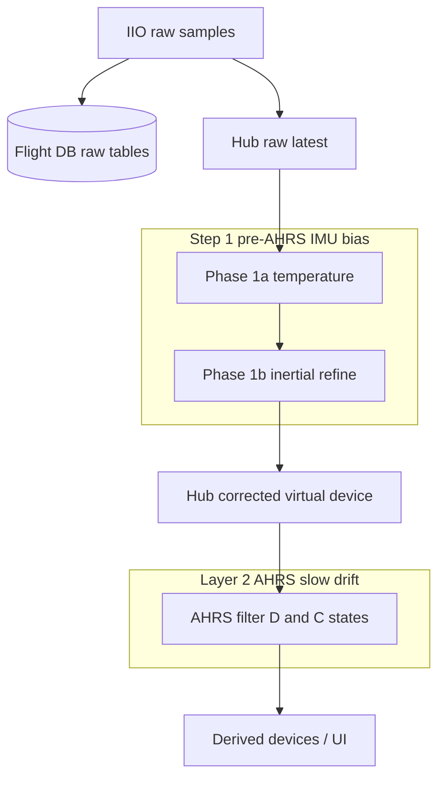

# ICM-45686 bias and temperature compensation

Plan for characterizing IMU bias vs die temperature, then applying a **two-step
correction pipeline** while **always persisting raw sensor readings** and
**logging on-chip offset registers at every startup**:

1. **Step 1 — pre-AHRS IMU bias layer** (two phases, same compensator):
   - **Phase 1a:** first-order temperature correction from characterized TCO/b₀
   - **Phase 1b:** inertial refinement when GPS + IMU indicate stationary
2. **Layer 2 — AHRS slow drift:** online bias states inside the AHRS engine to
   absorb residuals, nonlinearities, and effects Step 1 does not model

Scope: **ICM-45686 first** (cabin hub IMU). Pod and other IMUs follow once this
path is proven.

---

## Glossary

Terms used in the TDK/InvenSense datasheet and app notes:

| Term | Meaning |
|------|---------|
| **ZRO** (Zero-Rate Output) | Gyroscope **bias**: the non-zero rate the sensor reports when it is not rotating. Specified as initial tolerance at 25°C and as change vs temperature (°/s/°C). Same idea as “gyro offset” or “zero-rate offset.” |
| **Zero-G output** | Accelerometer **bias**: the output when no linear acceleration is applied (except gravity on the vertical axis). Specified as initial tolerance (mg) and change vs temperature (mg/°C). |
| **TCO** (Temperature Coefficient of Offset) | How much **bias** changes per °C: Δbias/ΔT. For ICM-45686 the datasheet gives **±0.005 °/s/°C** (gyro, board-level) and **±0.15 mg/°C** (accel, board-level). AN-000257 uses TCO in offset budgeting: `offset_over_T = TCO × TempVar`. |
| **TCS** (Temperature Coefficient of Sensitivity) | How much **scale factor** changes per °C (%/°C). ICM-45686: **±0.01 %/°C** for both gyro and accel. Affects apparent bias when the true input is non-zero; usually second-order for our use case. |
| **LDO** (Low-Dropout regulator) | On-chip **voltage regulator** that generates stable supply/reference for the MEMS front end. Datasheet §4.18 “Bias and LDOs” refers to this **power/reference block**, not sensor zero-rate bias. LDO drift with temperature contributes to TCO indirectly but is not user-calibratable. |
| **OFFUSER** | User-writable **on-chip bias trim** registers (`GYRO_*_OFFUSER`, `ACCEL_*_OFFUSER`). Exposed in Linux IIO as per-axis **`calibbias`**. Range ±62.5 dps (gyro) / ±1 g (accel). |
| **BoardVar** | Offset variation from **PCB assembly, mounting stress, and bending** (AN-000257). Partly permanent after install; not captured by die temperature alone. |
| **BalancedGyro** | TDK hardware gyro architecture aimed at low vibration- and temperature-induced rate error; no public equations. |
| **RTC** (Runtime Calibration) | Marketing term for on-chip self-calibration using the internal temperature sensor; details in AN-000478 / factory tools, not fully in the public datasheet tables. |

---

## Background (official specs)

**Datasheet:** DS-000577 (ICM-45686, Rev 1.0). **Related:** AN-000257 (offset
budgeting), AN-000265 (calibration), AN-000478 (user guide), AN-000393 (PCB/assembly).

### Published bias vs temperature (board-level, −40°C to +85°C)

| Sensor | Initial bias @ 25°C | Δ bias / ΔT |
|--------|---------------------|-------------|
| Gyro (ZRO) | ±0.3 °/s (component, production tested) | ±0.005 °/s/°C (characterization) |
| Accel (zero-g) | ±10 mg (component, production tested) | ±0.15 mg/°C (characterization) |

Over a **20°C** cabin/OAT swing: ~**0.1 °/s** gyro and ~**3 mg** accel — small
vs initial offset but meaningful for AHRS integration over minutes if uncorrected.

### Die temperature

On-chip sensor; same formula the driver uses:

```
T(°C) = TEMP_DATA / 128 + 25     (16-bit register / high-res FIFO)
T(°C) = FIFO_TEMP_DATA / 2 + 25  (8-bit FIFO field)
```

Kingfisher already logs `temp_c` on ICM45686 IIO devices via buffered capture.

### What we have today

| Layer | Behavior |
|-------|----------|
| [`icm45686-mod`](../icm45686-mod) | FIFO + `in_temp_*`; `calibbias` → `OFFUSER` |
| [`internal/sensors`](../internal/sensors) | Publishes **raw** accel/gyro/temp to hub + flight DB |
| [`internal/sensors/attrs.go`](../internal/sensors/attrs.go) | **`calibbias` already in `SnapshotAttrs`** |
| [`internal/sensors/sensors.go`](../internal/sensors/sensors.go) | Full attr snapshot at **startup** → `sensor_attrs` table |
| [`internal/derive/ahrs.go`](../internal/derive/ahrs.go) | **SimpleAHRS**, no bias estimation; uses hub samples as-is |

Kernel presents **two** IIO devices: `icm45686-accel` and `icm45686-gyro`. Each
gets its own startup `sensor_attrs` snapshot (including per-axis `calibbias`).

**Gap:** No Step 1 compensator (temperature or inertial); AHRS uses **SimpleAHRS**
which subtracts gyro bias state `D1/D2/D3` but **never estimates it online**
(unlike goflying **Kalman** variants, which slowly update `D` and `C` with
~1-hour drift time constants). No explicit metadata row summarizing “on-chip
offsets at boot” (scattered across `sensor_attrs` rows — sufficient if we query
them, but we should treat boot snapshot as mandatory and document the query).

---

## Goals

1. **Characterize** per-unit bias vs die temperature (lab + historical flights).
2. **Step 1 — pre-AHRS compensator** (single module, two phases):
   - **Phase 1a (temperature):** subtract `bias₀ + k×(T − T_ref)` per axis.
   - **Phase 1b (inertial refine):** when GPS + IMU indicate **stationary**
     inertial windows, nudge runtime trim on top of the temperature model.
3. **Layer 2 — AHRS slow drift:** enable online estimation of residual gyro/accel
   bias inside the AHRS filter (`D` / `C` in goflying) so heading/attitude
   integration is not poisoned by whatever linear temp model and ground cal miss.
4. **Never lose raw data:** flight DB tables keep **uncorrected** IIO values.
5. **Boot audit trail:** on-chip `OFFUSER` / `calibbias` logged on **every**
   kingfisher start (already happens via `SnapshotAttrs`; verify both accel and
   gyro devices, add tests/docs).
6. **ICM-45686 only** for v1; design Step 1 so other IMUs can plug in later.
   Layer 2 follows whichever AHRS provider kingfisher uses.

---

## Phase A — Analyze existing flight logs (starting point)

Before lab work, mine recent flight DBs on the Pi:

### Queries / plots

- **Temperature range:** min/max/mean of `temp_c` (or `temp`) on
  `icm45686_accel` / `icm45686_gyro` / merged `icm45686` tab data during flight.
- **Bias proxies during inertial windows:**
  - Ground/taxi: GPS speed &lt; ~2 kt, small angular rates → gyro mean ≈ bias.
  - Level static on ground: accel magnitude ≈ 1 g; residual after removing gravity
    in known attitude → accel bias proxy.
- **Slope estimate:** linear fit `bias_axis ~ temp_c` per axis; compare |k| to
  datasheet bounds (0.005 °/s/°C, 0.15 mg/°C).
- **On-chip trim at session start:** `sensor_attrs` where
  `attr='calibbias'` for `icm45686-accel` / `icm45686-gyro` at minimum
  `ts_ns` per flight DB.

### Deliverable

Short characterization note (even a section in this doc or a one-off script under
`scripts/`) with:

- Typical in-flight die temp range vs lab target range
- Observed bias stability and crude TCO per axis
- Whether temperature alone explains most drift or BoardVar / other effects dominate

Suggested script: extend [`scripts/analyze_flight_sampling.py`](../scripts/analyze_flight_sampling.py)
or add `scripts/analyze_imu_bias_temp.py`.

---

## Phase B — Lab temperature characterization

Deliberate **cold soak → warm-up → hot soak → cool-down** with kingfisher
recording continuously. Exercises a much wider ΔT than normal flight and
strengthens the linear (or low-order) fit.

### Protocol

1. **Setup**
   - Kingfisher running normal buffered IIO capture (hwfifo on ICM45686).
   - Unit **stationary** for entire run (on a foam pad; no handling during samples).
   - Log session notes in howgozit or aircraft notes field: “IMU temp cal run.”
   - Optional: mark phases via howgozit row or metadata key when phase changes.

2. **Cold soak**
   - Place entire kingfisher unit in freezer.
   - **Soak ≥ 2–3 hours** (colder than any in-air expectation).
   - While soaking: either pause recording or accept missing data; important part
     is **steady cold** before step (2).

3. **Cold → room warm-up**
   - Remove from freezer; leave **stationary** on bench.
   - Record **≥ 1–2 hours** as die temp rises toward ambient (capture transient +
     steady).

4. **Hot soak**
   - Place in controlled **hot box at 50–60°C** (below datasheet +85°C max, above
     any cabin temp).
   - **Soak ≥ 1–2 hours** at peak.

5. **Hot → room cool-down**
   - Remove from hot box; stationary bench cool-down **≥ 1–2 hours**.

6. **Safety**
   - No condensation on powered unit when moving cold → warm (bag/silica if needed).
   - Pi thermal limits: monitor throttling; hot-box setpoint may need to be Pi-safe
     even if die reaches target via soak time.

### Analysis

- Align `icm45686_gyro.anglvel_*` and `icm45686_accel.accel_*` with `temp_c`
  (merge on `ts_ns` or nearest-neighbor within one sample period).
- Per axis, per phase: fit  
  `bias_gyro = b0 + k_g × (T − T_ref)`  
  `bias_accel = a0 + k_a × (T − T_ref)`  
  Use robust regression (median bins by temp) if noise is high.
- Compare fits from cold→warm vs hot→cool for **hysteresis** (datasheet only
  specifies magnitude of TCO, not hysteresis).
- Store fitted coefficients in config (see below).

---

## Phase C — Implementation architecture

### Pipeline overview

Three distinct stages. **Step 1** is one pre-AHRS compensator with two phases;
**Layer 2** is inside the AHRS filter, not in the IMU compensator.



| Stage | Where | Time scale | What it catches |
|-------|-------|------------|-----------------|
| **Step 1a** | `internal/derive/imubias/` | Per sample | Linear TCO, lab-fitted b₀ |
| **Step 1b** | Same module | Seconds–minutes (stationary dwell) | BoardVar, b₀ error, mild nonlinearity at current T |
| **Layer 2** | goflying AHRS (`D`, `C` states) | Minutes–hours (~√3600 s process noise in Kalman) | Residual gyro/accel bias, drift SimpleAHRS cannot see, in-flight effects Step 1 misses |

**Division of responsibility:**

- **Step 1** produces the best **sensor-centric** estimate of bias before fusion.
  Output is a corrected IMU stream; coefficients come from lab + ground inertial
  windows. Phase 1b may persist runtime trim across flights (config sidecar) but
  stays in the IMU layer.
- **Layer 2** treats whatever remains as **navigation-state bias** to be learned
  during flight. It must receive Step-1-corrected ω and a (not raw) so it is not
  duplicating the temperature work. It handles slow drift, hysteresis, and other
  unmodeled effects without requiring an explicit T input.

- **Persist raw only** in SQLite device tables (`icm45686_accel`, `icm45686_gyro`).
- **Corrected stream** feeds AHRS and optional UI; clearly named (e.g. virtual
  device `icm45686` or `icm45686_corr`) so replay distinguishes raw vs corrected.
- **Do not** write `calibbias` to hardware automatically in v1 (risk of fighting
  on-chip RTC/APEX if enabled). Optional later: mirror persistent trim to
  `OFFUSER` on shutdown with explicit operator enable.

---

### Step 1 — Pre-AHRS IMU bias compensator

Single goroutine/module subscribing to raw hub samples (accel, gyro, temp, GPS
fix for Phase 1b). Applies both phases before publishing the virtual corrected
device.

#### Step 1, Phase 1a — Temperature correction

Per axis *i* at die temperature *T* (°C):

```
ω_temp_i = ω_raw_i − (b0_i + k_i × (T − T_ref))
a_temp_i = a_raw_i − (a0_i + c_i × (T − T_ref))
```

- **Coefficients** `(b0, k)` / `(a0, c)` from Phase A/B characterization; stored
  in `config.json` (`imu_bias.icm45686.*`).
- **Defaults:** `k=0`, `b0=0` until characterized; `T_ref` = mean temp from lab
  run or 25°C.
- **Units:** gyro °/s internally (convert at AHRS boundary as today); accel m/s².
- **Missing temp:** skip Phase 1a (pass raw) or use last-known T with staleness limit.

#### Step 1, Phase 1b — Inertial refinement

Runs on **Phase 1a output** (`ω_temp`, `a_temp`). “Inertial” here means no
meaningful user-induced motion — not a free-inertial navigation frame.

**Detect (all required, thresholds tunable):**

- GPS fix valid, ground speed &lt; `v_thresh` (e.g. 2 kt)
- GPS track change rate small (optional)
- Gyro magnitude &lt; `ω_thresh` (e.g. 0.5 °/s) on temp-corrected rates
- Accel deviation from gravity vector &lt; `a_thresh` (attitude stable)
- Minimum dwell time (e.g. 5–10 s)

**Update:**

- Gyro: block mean of `ω_temp` → residual `δb`; slow IIR into runtime trim
  `b_trim` (additive to Phase 1a):  
  `ω_out = ω_temp − b_trim`.
- Accel: expected gravity in body frame (attitude from last good AHRS or level
  assumption on ground) → residual into `a_trim`.

**Persistence:**

- **In-flight:** `b_trim` / `a_trim` in memory; reset each boot unless loaded.
- **Across flights:** optional sidecar
  `~/.config/kingfisher/imu_bias_runtime.json` so lab `b0`/TCO in main config
  stay immutable; trim captures install-specific offset.

Phase 1b **does not** replace Layer 2: it only tightens the feed going into AHRS
on the ground and during long straight-and-level segments where gates pass.

**New code (Step 1 sketch):**

| Piece | Location |
|-------|----------|
| Config types | [`internal/config/config.go`](../internal/config/config.go) |
| Compensator | `internal/derive/imubias/` (new) — `Correct(raw, gps, cfg, runtime) → corrected` |
| Wiring | [`cmd/kingfisher/main.go`](../cmd/kingfisher/main.go) |
| AHRS input | [`internal/derive/ahrs.go`](../internal/derive/ahrs.go) — `findIMU` prefers corrected device |

---

### Layer 2 — AHRS slow drift (residual bias)

Inside the AHRS engine ([`goflying/ahrs`](../../goflying/ahrs)), not in `imubias`.

**Current kingfisher:** [`internal/derive/ahrs.go`](../internal/derive/ahrs.go)
uses **SimpleAHRS**, which applies `m.B − D` but leaves **`D1/D2/D3` at zero**
(no online learning). Accel bias **`C1/C2/C3`** similarly unused.

**Target:** AHRS consumes **Step-1-corrected** IMU and **estimates remaining
bias online**:

| State | Frame | Role |
|-------|-------|------|
| `D1,D2,D3` | Sensor / aircraft (per goflying convention) | Residual **gyro** bias, °/s |
| `C1,C2,C3` | Sensor | Residual **accel** bias, G |

**Implementation options (pick during review):**

1. **Switch kingfisher to Kalman AHRS** (`ahrs.NewKalman()` or staged variant) —
   already updates `D`/`C` in the update step with ~1-hour bias drift time
   constant (`tt := sqrt(3600)` in `ahrs_kalman.go`). Lowest new math; larger
   behavior change vs SimpleAHRS.
2. **Extend SimpleAHRS** with slow bias observers (e.g. ZUPT-style nudge of `D`
   when stationary, complementary to Step 1b but at AHRS rate and fused with
   attitude). Smaller diff; duplicate logic risk if not careful.
3. **Hybrid:** Kalman for bias states only — likely overkill; prefer (1) or (2).

**Layer 2 expectations:**

- Operates on **residuals** after Step 1; time constant **slower** than Phase 1b
  (minutes–hours vs seconds–minutes) so the two are not fighting.
- Captures nonlinear TCO, hysteresis, in-flight vibration rectification, and
  model error without explicit temperature terms.
- Optional: log effective `D`/`C` to flight DB (new virtual columns on `ahrs` or
  metadata snapshots) for post-flight audit.

**Wiring:**

| Piece | Location |
|-------|----------|
| Provider selection | [`internal/config/config.go`](../internal/config/config.go) — `ahrs.provider` |
| AHRS loop | [`internal/derive/ahrs.go`](../internal/derive/ahrs.go) — corrected IMU in `buildMeasurement` |
| Bias dynamics | [`goflying/ahrs/ahrs_kalman*.go`](../../goflying/ahrs) — tune process noise if needed |

### On-chip offsets at initialization

**Requirement:** every kingfisher start records `GYRO_*_OFFUSER` /
`ACCEL_*_OFFUSER` values.

**Current behavior:** [`sensors.Run`](../internal/sensors/sensors.go) calls
`SnapshotAttrs` → `st.LogAttrs` for each IIO reader at startup; includes
`calibbias` per channel.

**Plan tasks:**

1. **Verify** on hardware that both `icm45686-accel` and `icm45686-gyro` expose
   readable `calibbias` for x/y/z at boot.
2. **Test** attr snapshot includes all six gyro + six accel calibbias values
   (unit test with fake reader).
3. **Optional convenience:** duplicate boot snapshot into `metadata` keys
   `imu_icm45686_offuser_gyro_x` etc. for one-row audit (not required if
   `sensor_attrs` query is documented).

### Driver note — on-chip RTC / APEX

Before trusting lab fits, confirm [`icm45686-mod`](../icm45686-mod) init does
**not** enable EDMP/APEX bias tracking that would move the effective zero during
soak. If on-chip correction is active, either:

- Characterize **residual** bias after on-chip correction (still valid), or
- Disable APEX/EDMP for characterization runs (driver/register change; separate
  task).

Check AN-000478 and `inv_icm45600_core.c` power-on defaults.

---

## Configuration sketch

```json
{
  "imu_bias": {
    "icm45686": {
      "enabled": true,
      "t_ref_c": 25.0,
      "gyro": {
        "x": { "b0_dps": 0.0, "tco_dps_per_c": 0.0 },
        "y": { "b0_dps": 0.0, "tco_dps_per_c": 0.0 },
        "z": { "b0_dps": 0.0, "tco_dps_per_c": 0.0 }
      },
      "accel": {
        "x": { "b0_mps2": 0.0, "tco_mps2_per_c": 0.0 },
        "y": { "b0_mps2": 0.0, "tco_mps2_per_c": 0.0 },
        "z": { "b0_mps2": 0.0, "tco_mps2_per_c": 0.0 }
      },
      "inertial_refine": {
        "comment": "Step 1 Phase 1b — pre-AHRS stationary trim",
        "enabled": true,
        "gps_speed_max_kt": 2.0,
        "gyro_max_dps": 0.5,
        "min_dwell_s": 8.0,
        "update_gain": 0.01
      }
    }
  },
  "ahrs": {
    "provider": "kalman",
    "comment": "Layer 2 — enable online D/C bias; was simple (no bias learn)",
    "bias_drift_time_s": 3600
  }
}
```

Unit conversions when loading from lab fits:

- Gyro TCO: datasheet mg-style uses °/s/°C directly.
- Accel TCO: datasheet **mg/°C** → m/s²/°C via × 9.80665e−3.

---

## Implementation order

1. **Analysis tooling** — past-log temp range + bias slope script (Phase A).
2. **Lab run** — execute Phase B protocol; fill Step 1a coefficients in config.
3. **Step 1a** — temperature compensator + virtual corrected device; AHRS still
   SimpleAHRS; verify raw DB unchanged.
4. **Boot attr verification** — test + doc for `calibbias` snapshot.
5. **Step 1b** — inertial refinement in same `imubias` module (GPS gates, runtime trim).
6. **Layer 2** — AHRS provider with online `D`/`C` (likely Kalman); feed corrected
   IMU only; tune drift time constant; compare heading hold vs Step 1 alone.
7. **Cockpit** — optional display of Step 1 trim + AHRS `D` (later).
8. **Document** — update CLAUDE.md: raw → Step 1 → AHRS Layer 2 data flow.

---

## Testing

- Unit tests: Step 1a compensation math, Step 1b gate logic, config parse, missing-temp fallback.
- Replay test: load flight DB raw rows, apply Step 1 offline, compare to lab fit.
- Layer 2: AHRS tests with injected residual bias — verify `D`/`C` converge without
  fighting Step 1 (stationary ground segment in sim or recorded DB).
- Regression: [`internal/derive/ahrs_test.go`](../internal/derive/ahrs_test.go)
  updated for corrected IMU input and chosen AHRS provider.

---

## Future sensors

Same **Step 1** pattern after ICM-45686:

- Pod IMUs (if any), ICM-20948 cabin backup, etc.
- Shared `internal/derive/imubias` interface keyed by device name.
- Per-sensor config block and characterization (pod: use its own die temp when available).

**Layer 2** is sensor-agnostic once corrected IMU reaches AHRS.

---

## Open questions (refine before implement)

1. **Virtual device name** for Step 1 output: extend existing `icm45686` tab vs
   new `icm45686_corr`?
2. **UI:** show raw, Step-1-corrected, or both in cockpit IMU tab during bring-up?
3. **Hot box:** exact setpoint limited by Pi 5 enclosure thermal coupling to die?
4. **Write `OFFUSER` from software** after Step 1b trim — ever, or software-only?
5. **Layer 2 provider:** full Kalman vs extended SimpleAHRS — trade integration
   risk vs bias-state maturity?
6. **Step 1b vs Layer 2 both active on ground:** ensure time constants / gates
   prevent double-counting stationary bias updates.

---

## References

- [ICM-45686 product page / DS-000577](https://invensense.tdk.com/en-us/products/motion-tracking/6-axis/icm-45686/)
- AN-000257 — Understanding IMU Sensor Offset (TCO, BoardVar, offset budgeting)
- AN-000265 — IMU Calibration Application Note
- AN-000478 — ICM-45605 & ICM-45686 User Guide
- [`docs/timestamps.md`](timestamps.md) — sample time bases for offline alignment
